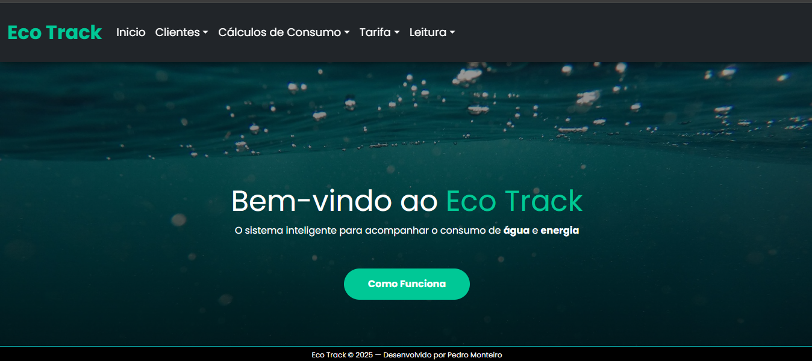
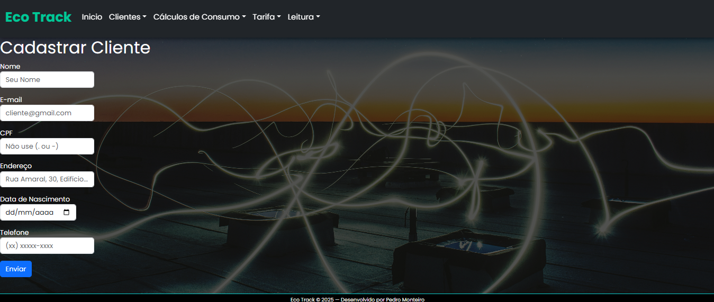

# Eco Track

## Visão Geral

O **Eco Track** é um sistema web desenvolvido para controle e análise de consumo de **água e energia elétrica**, simulando um cenário de uso real.  
O projeto permite organizar dados de consumo de equipamentos domésticos, como geladeira, ventilador, roteador Wi-Fi, entre outros, auxiliando na compreensão do impacto de cada item nos gastos mensais.

Este projeto foi desenvolvido para **execução em ambiente local (localhost)**, utilizando **XAMPP**, com foco em aprendizado técnico, organização de código e arquitetura de sistemas.

---

## Funcionalidades

- CRUD completo dividido em três módulos principais:
  - **Licenças**
  - **Tarifas**
  - **Leituras**
- Área específica para cálculos de:
  - Consumo de água
  - Consumo de energia elétrica
  - Consumo combinado (água + energia)
- Estrutura preparada para expansão e novos cálculos
- Simulação de um sistema aplicado a um contexto real

---

## Tecnologias Utilizadas

- **Front-end:** HTML, CSS, JavaScript  
- **Back-end:** PHP  
- **Banco de Dados:** MySQL  
- **Servidor Local:** Apache (XAMPP)

---

## Arquitetura do Projeto

O Eco Track foi desenvolvido com foco em **organização e separação de responsabilidades**, aplicando conceitos de arquitetura limpa dentro de um ambiente web simples.

Estrutura do projeto:

- **/css** – estilos da aplicação  
- **/js** – scripts e interações do front-end  
- **/imgs** – recursos visuais  
- **/includes** – arquivos reutilizáveis e configurações  
- **/logic** – lógica de cálculo (água, energia e total)  
- **/pages** – páginas organizadas por domínio:
  - cliente
  - leitura
  - tarifa
- **/sql** – scripts relacionados ao banco de dados

O banco de dados utiliza **relacionamentos com chaves estrangeiras**, garantindo integridade e organização dos dados.

---

## Objetivos de Aprendizado

Com o desenvolvimento deste projeto, foi possível:

- Consolidar o uso de **CRUDs em aplicações web**
- Trabalhar com **MySQL**, incluindo relacionamentos e chaves estrangeiras
- Aplicar conceitos de **organização de código e arquitetura**
- Evoluir no uso de **PHP integrado ao front-end**
- Desenvolver um sistema com mentalidade de **aplicação real**
- Expandir e adaptar estruturas dentro do ambiente FreeWorking

---

## Screenshots

### Tela Inicial

### Cadastro de Clientes

### Cálculos de Consumo

---

## Execução do Projeto

O sistema foi desenvolvido para rodar em **localhost**, utilizando **XAMPP**.

### Passos para Execução

1. Certifique-se de ter o **XAMPP** instalado e com os módulos **Apache** e **MySQL** ativos.
2. Clone ou mova a pasta do projeto para: C:\xampp\htdocs\Eco_Track
