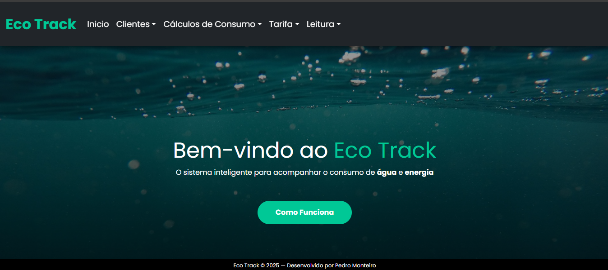
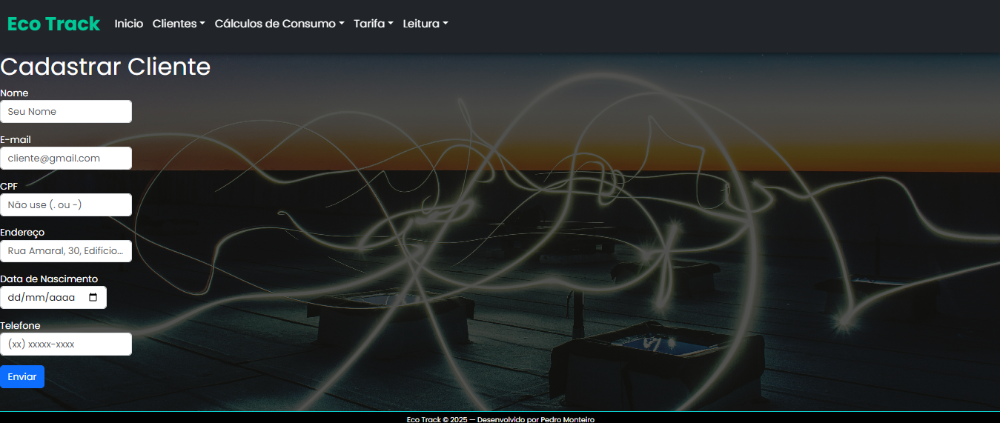
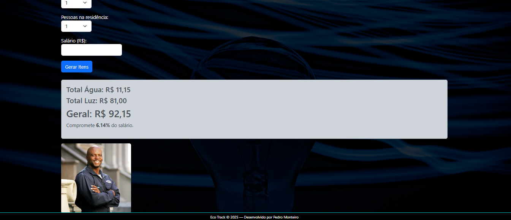

# Eco Track 

Sistema web para controle e análise do consumo de água e energia elétrica, desenvolvido com PHP e MySQL.

## Visão Geral

O **Eco Track** é uma aplicação web que permite registrar, organizar e analisar dados relacionados ao consumo de água e energia elétrica em um ambiente doméstico.

O sistema simula um cenário de uso real, permitindo acompanhar o consumo de equipamentos como geladeira, ventilador e roteador Wi-Fi, além de realizar cálculos que ajudam a compreender os gastos associados.

O projeto foi desenvolvido para execução em ambiente local, utilizando **XAMPP**, com foco no desenvolvimento web, gerenciamento de dados e aplicação de conceitos de arquitetura de sistemas.

---

## Funcionalidades

* **Gerenciamento de dados (CRUD):**

  * Licenças
  * Tarifas
  * Leituras
* **Cálculos de consumo:**

  * Consumo de água
  * Consumo de energia elétrica
  * Consumo combinado de água e energia
* Organização de informações relacionadas ao consumo doméstico.
* Estrutura preparada para futuras expansões e novos cálculos.

---

## Tecnologias Utilizadas

| Tecnologia | Aplicação                             |
| ---------- | ------------------------------------- |
| HTML5      | Estrutura das páginas                 |
| CSS3       | Estilização e layout                  |
| JavaScript | Interações no front-end               |
| PHP        | Lógica e processamento no back-end    |
| MySQL      | Persistência e gerenciamento de dados |
| Apache     | Servidor web local                    |
| XAMPP      | Ambiente de desenvolvimento local     |

---

## Arquitetura do Projeto

O projeto utiliza uma estrutura modular, com arquivos organizados de acordo com suas responsabilidades, buscando facilitar a manutenção e a evolução da aplicação.

### Estrutura de Diretórios

```text
Eco_Track/
├── css/         # Estilos da aplicação
├── js/          # Scripts e interações
├── imgs/        # Recursos visuais
├── includes/    # Arquivos reutilizáveis e configurações
├── logic/       # Lógica dos cálculos de consumo
├── pages/       # Páginas organizadas por domínio
│   ├── cliente/
│   ├── leitura/
│   └── tarifa/
├── sql/         # Scripts do banco de dados
└── docs/        # Imagens para documentação
```

O banco de dados utiliza relacionamentos e chaves estrangeiras para estruturar as informações e manter a integridade dos dados.

---

## Screenshots

### Tela Inicial



### Cadastro de Clientes



### Cálculos de Consumo



---

## Execução do Projeto

O Eco Track foi desenvolvido para execução local utilizando o **XAMPP**.

### Pré-requisitos

* [XAMPP](https://www.apachefriends.org/)
* Navegador web
* Git (opcional, para clonar o repositório)

### Passos para Execução

1. Clone o repositório:

   ```bash
   git clone https://github.com/phsmontheiro-glitch/Eco_Track.git
   ```

2. Mova a pasta do projeto para o diretório `htdocs` do XAMPP:

   ```text
   C:\xampp\htdocs\Eco_Track
   ```

3. Abra o painel de controle do XAMPP e inicie os módulos **Apache** e **MySQL**.

4. Acesse o phpMyAdmin pelo navegador:

   ```text
   http://localhost/phpmyadmin
   ```

5. Crie o banco de dados e importe os scripts SQL disponíveis na pasta `sql/`, conforme a estrutura do projeto.

6. Verifique as configurações de conexão com o banco de dados nos arquivos correspondentes da pasta `includes/`.

7. Acesse a aplicação pelo navegador:

   ```text
   http://localhost/Eco_Track/
   ```

> **Observação:** A configuração do banco de dados deve corresponder aos nomes e parâmetros definidos nos arquivos do projeto.

---

## Objetivos de Aprendizado

O desenvolvimento do Eco Track proporcionou a oportunidade de:

* Desenvolver operações CRUD utilizando PHP e MySQL.
* Trabalhar com relacionamentos entre tabelas e chaves estrangeiras.
* Aplicar conceitos de organização de código e separação de responsabilidades.
* Integrar tecnologias de front-end e back-end.
* Implementar cálculos relacionados ao consumo de recursos domésticos.
* Desenvolver uma aplicação web considerando organização, manutenção e possibilidades de expansão.

---

## Contexto do Projeto

**Tipo:** Aplicação web
**Execução:** Ambiente local (localhost)
**Área:** Desenvolvimento Web / Back-end
**Finalidade:** Projeto acadêmico e de aprendizado

---

## Autor

**[Pedro Henrique Silva Monteiro](https://github.com/phsmontheiro-glitch)**
